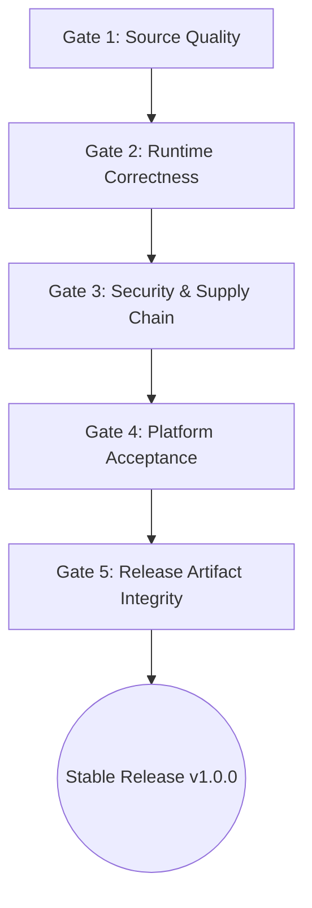

# P04 Release Gates

Bu doküman, Vane uygulamasının Stable Production Release sürümünü alabilmesi için geçmek zorunda olduğu kapıları (Gates) ve bunların mevcut durumlarını tanımlar.

---

## 1. Release Kapıları Genel Bakış

Production yayın sürecinde herhangi bir Gate başarısız olursa release derlemesi durdurulur ve sürüm etiketi verilmez.

---

## 2. Gate Tanımları ve Kriterleri

### Gate 1 — Source Quality (Kod Kalitesi Kapısı)
Tüm kaynak kodun derlenebilir, test edilmiş, formatlanmış ve statik analizlerden geçmiş olması zorunludur.

- **Status:** **In Progress**
- **Owner:** Core Engineering
- **Criteria:**
  - [x] TypeScript build hatasız tamamlanıyor (`npm run build`).
  - [x] Frontend birim testleri hatasız tamamlanıyor (`npm test`).
  - [x] Rust birim testleri hatasız tamamlanıyor (`cargo test --lib`).
  - [x] Rust Clippy sıfır uyarı/hata veriyor (`cargo clippy --lib -- -D warnings`).
  - [x] Frontend bağımlılık zafiyet denetimi temiz (`npm audit --audit-level=high`).
  - [ ] Rust bağımlılık zafiyet denetimi uyarısız/audit onaylı (`cargo audit`).
- **Evidence:** `ci.yml` workflow çıktısı, local test sonuçları.
- **Blocking Risks:** R-24 (IPC Type Separation).

---

### Gate 2 — Runtime Correctness (Çalışma Zamanı Doğruluğu Kapısı)
Uygulama durum mekanizmasının, yarış durumlarının ve süreç sahipliğinin kusursuz çalışması zorunludur.

- **Status:** **Not Started**
- **Owner:** Runtime & Architecture Team
- **Criteria:**
  - [ ] Pattern cache ve disk kaynak yarış durumu (Race Condition) tamamen çözülmüş (R-01).
  - [ ] Process ownership ve Job Object entegrasyonu tamamlanmış, yetim süreç kalmıyor (R-05, R-06, R-07).
  - [ ] Preset semantic validation ve phase-order doğrulama katmanı aktif (R-10).
  - [ ] Motor durumunda `Running` ve `Healthy` durumları birbirinden ayrılmış (R-17).
  - [ ] Eşzamanlı başlatma/durdurma stres testleri (Concurrent Start/Stop) geçilmiş.
- **Evidence:** P03 - P07 safha test raporları.
- **Blocking Risks:** R-01, R-05, R-06, R-07, R-10, R-17.

---

### Gate 3 — Security & Supply Chain (Güvenlik ve Tedarik Zinciri Kapısı)
Uygulama paketlerinin, binary dosyalarının ve güncellemelerin güvenliği garanti altına alınmalıdır.

- **Status:** **Not Started**
- **Owner:** Security & Release Team
- **Criteria:**
  - [ ] Bundled binary'lerin (`winws`, `WinDivert64.sys`) SHA-256 hash doğrulaması release pipeline'ında çalışıyor (R-19).
  - [ ] Tüm updater ve remote preset yüklemeleri geçerli Minisign imzasına sahip.
  - [ ] Kill Switch crash recovery ve otomatik rollback mekanizması doğrulandı (R-22).
  - [ ] Güvenlik duvarı kuralları Vane UUID sahipliği ile etiketlendi (R-21).
  - [ ] Software Bill of Materials (SBOM) bildirimi oluşturuldu.
- **Evidence:** P13 Security audit dokümanı.
- **Blocking Risks:** R-19, R-21, R-22, R-23.

---

### Gate 4 — Platform Acceptance (Platform Kabul Kapısı)
Uygulamanın hedef işletim sistemlerinde sorunsuz çalıştığının kanıtlanmasıdır.

- **Status:** **In Progress** (Windows için In Progress, Linux Experimental)
- **Owner:** QA & Desktop Platform Team
- **Criteria (Windows - Production Target):**
  - [ ] Windows 10 (22H2) üzerinde paketlenmiş kabul testleri başarılı.
  - [ ] Windows 11 (23H2 / 24H2) üzerinde paketlenmiş kabul testleri başarılı.
  - [ ] NSIS Installer, Per-Machine kurulum ve uninstaller artık bırakmıyor.
  - [ ] WinDivert sürücüsü sorunsuz yüklenip kaldırılabiliyor.
  - [ ] System DNS ve Kill Switch otomatik eski haline dönüyor.
- **Criteria (Linux - Experimental Target):**
  - [ ] Linux desteği açıkça **Experimental** olarak işaretlendi.
  - [ ] Linux uyumsuzluğu Stable Windows sürümünü bloklamayacak şekilde izole edildi.
- **Evidence:** `windows-acceptance-build.yml` ve P11 Linux dokümanı.
- **Blocking Risks:** R-03, R-04, R-20.

---

### Gate 5 — Release Artifact Integrity (Yayın Paketi Bütünlüğü Kapısı)
Yayınlanacak sürüm paketlerinin ve manifestolarının son doğrulamasıdır.

- **Status:** **Not Started**
- **Owner:** Release Lead
- **Criteria:**
  - [ ] Tüm konfigürasyon ve manifest dosyalarında sürüm tutarlılığı onaylandı (`package.json`, `Cargo.toml`, `tauri.conf.json`).
  - [ ] Preset korpusu otomatik doğrulama testinden geçti.
  - [ ] Windows NSIS paketleri Authenticode ile imzalandı.
  - [ ] Updater `latest.json` manifesi ve Minisign `.sig` dosyaları üretildi.
  - [ ] GitHub Draft Release oluşturulup manuel onay alındı.
- **Evidence:** Release Checklist onay formu.
- **Blocking Risks:** R-02, R-18.
